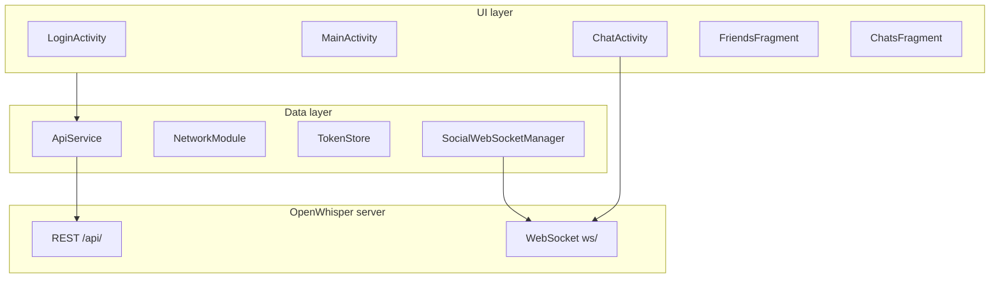

# OpenWhisper Android

Android client for [OpenWhisper-Desktop](https://github.com/JochemKuipers/OpenWhisper-Desktop). The app talks to a self-hosted OpenWhisper server over REST and WebSocket; you need a running backend instance to sign in and use chat features.

## Features

- JWT authentication (login, register, logout, token refresh)
- Chat list and direct messages
- Real-time messages via per-chat WebSocket
- Friends tab: search, friend requests, accept/decline, unfriend
- Group chat admin: rename, invite, remove members
- File attachments (send, preview images, open, download to Downloads)
- Social WebSocket for friend-request and chat-list updates
- Settings: custom instance URL, light/dark/system theme

## Requirements

- **JDK 17**
- **Android SDK** with `compileSdk` 37 (Android Studio Ladybug or newer recommended)
- A running [OpenWhisper-Desktop](https://github.com/JochemKuipers/OpenWhisper-Desktop) server

## Quick start

1. Clone this repository.
2. Open the project in Android Studio.
3. Start your OpenWhisper server (see the Desktop repo).
4. Run the **debug** build on an emulator or device.

Debug builds default to `http://10.0.2.2:8000/api/` — that is the emulator’s alias for your machine’s `localhost:8000`. On a physical device, set a custom instance URL in **Settings** (see below).

## Server setup

Follow the [OpenWhisper-Desktop](https://github.com/JochemKuipers/OpenWhisper-Desktop) README to install and run the API.

Debug builds allow cleartext HTTP via `app/src/debug/res/xml/network_security_config.xml`. Release builds expect HTTPS unless you configure otherwise on the server side.

## Configuration

In **Settings → Instance URL**, enter your server host (for example `192.168.1.10:8000` or `https://chat.example.com`). The value is normalized by `ApiConfig.normalizeCustomUrl()`:

- Adds `https://` when no scheme is given
- Appends `/api/` when the path is empty
- Ensures a trailing slash for Retrofit

Changing the URL triggers `OpenWhisperApp.recreateNetworkModule()` so Retrofit and WebSocket clients pick up the new base URL.

## Architecture



| Layer | Responsibility |
|-------|----------------|
| **UI** (`ui/`) | Activities, fragments, adapters, view binding |
| **Data** (`data/`) | Retrofit API, OkHttp auth, token storage, WebSocket managers |
| **Model** (`model/`) | Gson DTOs matching the server API |
| **Util** (`util/`) | Attachments, timestamps, error messages, theming |

`OpenWhisperApp` wires `SettingsStore`, `NetworkModule`, and `SocialWebSocketManager` at startup. Chat titles and member subtitles come from server fields `display_title` and `member_subtitle`.

## Project layout

```
app/src/main/java/com/openwhisper/android/
├── data/          ApiService, NetworkModule, TokenStore, WebSocket managers
├── model/         REST and WebSocket payload types
├── ui/
│   ├── login/     LoginActivity, RegisterActivity
│   ├── main/      MainActivity, FriendsFragment, SettingsFragment
│   ├── rooms/     ChatsFragment, RoomsAdapter
│   └── chat/      ChatActivity, attachments, group info sheet
└── util/          AttachmentUtils, ApiErrors, MessageTimestamps, …
```

## Testing

### Unit tests (JVM)

Fast tests for models, utilities, and data-layer logic. JSON fixtures live in `app/src/test/resources/fixtures/`.

```bash
./gradlew testDebugUnitTest
```

Robolectric is pinned to SDK 35 via `app/src/test/resources/robolectric.properties` because `compileSdk` is 37.

### Instrumented tests (Espresso)

UI flows use **MockWebServer** on-device; the test harness points the app at `http://127.0.0.1:<port>/api/` and registers an OkHttp idling resource for Espresso sync.

```bash
./gradlew connectedDebugAndroidTest
```

Requires a connected emulator or device. CI runs these on an API 30 x86_64 emulator (see below).

### Lint

```bash
./gradlew lintDebug
```

Reports are written to `app/build/reports/lint-results-debug.html`.

### What is not covered

- End-to-end tests against a live OpenWhisper-Desktop instance
- WebSocket integration tests (would need a WS test server)
- Visual regression / screenshot tests

Run instrumented tests locally if CI emulator jobs are flaky.

## Continuous integration

GitHub Actions runs on every push and pull request (`.github/workflows/android.yml`):

- **unit-and-lint** — `testDebugUnitTest` and `lintDebug` on Ubuntu (JDK 17, 21, 23)
- **instrumented** — `connectedDebugAndroidTest` on an Android emulator

## Releasing

Releases are published to **GitHub Releases** when you push a version tag (`v1.0.0`, `v1.0.1`, …). The release workflow (`.github/workflows/release.yml`) runs tests, builds a signed APK, and attaches it to the release.

### One-time setup

1. **Signing key** — you should already have `openwhisper-upload.jks` in the project root (gitignored).
2. **Local builds** — copy `keystore.properties.example` to `keystore.properties` and fill in your passwords:

   ```properties
   storeFile=openwhisper-upload.jks
   storePassword=…
   keyAlias=openwhisper
   keyPassword=…
   ```

3. **GitHub Actions secrets** — in the repo go to **Settings → Secrets and variables → Actions** and add:

   | Secret | Value |
   |--------|--------|
   | `ANDROID_KEYSTORE_BASE64` | Base64-encoded `.jks` file |
   | `ANDROID_KEYSTORE_PASSWORD` | Keystore password |
   | `ANDROID_KEY_ALIAS` | Key alias (e.g. `openwhisper`) |
   | `ANDROID_KEY_PASSWORD` | Key password |

   Encode the keystore (PowerShell):

   ```powershell
   [Convert]::ToBase64String([IO.File]::ReadAllBytes("openwhisper-upload.jks"))
   ```

### Cut a release

1. Bump `versionCode` and `versionName` in `app/build.gradle.kts`.
2. Commit and push to `main`.
3. Tag and push:

   ```bash
   git tag v1.0.1
   git push origin v1.0.1
   ```

4. GitHub Actions builds `openwhisper-android-1.0.1.apk` and attaches it to the release.

### Local release build

With `keystore.properties` in place:

```bash
./gradlew assembleRelease
```

Signed APK: `app/build/outputs/apk/release/app-release.apk`

Users install the APK and set their OpenWhisper server URL in **Settings → Instance URL**.

## License

MIT — see [LICENSE](LICENSE).
